# pba-graphql

## System Design

The architecture provided is a solid foundation for a GraphQL-based application using Go.

```mermaid
graph LR
    classDef clientStyle fill:#f9f,stroke:#333,stroke-width:2px;
    classDef serverStyle fill:#bbf,stroke:#333,stroke-width:2px;
    classDef middlewareStyle fill:#ffcc00,stroke:#333,stroke-width:2px;
    classDef logicStyle fill:#90ee90,stroke:#333,stroke-width:2px;
    classDef repoStyle fill:#ff9999,stroke:#333,stroke-width:2px;
    classDef dbStyle fill:#ffccff,stroke:#333,stroke-width:2px;
    classDef serviceStyle fill:#ffff99,stroke:#333,stroke-width:2px;
    classDef monitoringStyle fill:#ccffcc,stroke:#333,stroke-width:2px;
    classDef metricsStyle fill:#ccccff,stroke:#333,stroke-width:2px;

    Client[Client]:::clientStyle <--> |GraphQL Requests| GraphQL_Server[GraphQL Server]:::serverStyle
    GraphQL_Server -->|Middleware| Middleware[Middleware]:::middlewareStyle
    Middleware -->|Business Logic| Business_Logic[Business Logic]:::logicStyle
    Business_Logic <--> |Data Access| Repository[Repository]:::repoStyle
    Repository <--> |Database Queries| Database_Layer[Database Layer]:::dbStyle
    Database_Layer <--> |PostgreSQL| PostgreSQL[PostgreSQL]:::dbStyle
    Business_Logic -->|Logging| Logging_Service[Logging Service]:::serviceStyle
    Business_Logic -->|Monitoring| Monitoring_Service[Monitoring Service]:::monitoringStyle
    Monitoring_Service -->|Metrics| Prometheus[Prometheus]:::metricsStyle
    Prometheus -->|Visualization| Grafana[Grafana]:::metricsStyle
    Business_Logic -->|Response| GraphQL_Server

    linkStyle 0 stroke:#333,stroke-width:2px,stroke-dasharray: 5, 5;
    linkStyle 1 stroke:#333,stroke-width:2px,stroke-dasharray: 5, 5;
    linkStyle 2 stroke:#333,stroke-width:2px,stroke-dasharray: 5, 5;
    linkStyle 3 stroke:#333,stroke-width:2px,stroke-dasharray: 5, 5;
    linkStyle 4 stroke:#333,stroke-width:2px,stroke-dasharray: 5, 5;
    linkStyle 5 stroke:#333,stroke-width:2px,stroke-dasharray: 5, 5;
    linkStyle 6 stroke:#333,stroke-width:2px,stroke-dasharray: 5, 5;
    linkStyle 7 stroke:#333,stroke-width:2px,stroke-dasharray: 5, 5;
    linkStyle 8 stroke:#333,stroke-width:2px,stroke-dasharray: 5, 5;
    linkStyle 9 stroke:#333,stroke-width:2px,stroke-dasharray: 5, 5;
    linkStyle 10 stroke:#333,stroke-width:2px,stroke-dasharray: 5, 5;
```



## Technology Stack

- **Backend**: Go
- **API Layer**: GraphQL (Library using gqlgen)
- **Web Framework**: Gin
- **Database**: PostgreSQL (optional)
- **Dependencies Management**: Go Modules

## Project Structure

```cmd
project-root/
├── cmd/
│   └── main.go
├── graph/
│   ├── generated/
│   │   └── generated.go
│   ├── models/
│   │   └── models_gen.go
│   ├── resolver.go
│   ├── schema.graphqls
│   └── schema.resolvers.go
├── internal/
│   ├── app/
│   │   ├── database/
│   │   │   └── db.go
│   │   ├── monitoring/
│   │   │   └── metric.go
│   │   └── middleware/
│   │       └── auth_middleware.go
│   ├── entity/
│   │   └── user.go
│   ├── repository/
│   │   └── user.go
│   ├── service/
│   │   └── user.go
│   └── util/
│       ├── exception/
│       │   └── helper.go
│       └── logger/
│           └── logger.go
├── logs/
│   └── app.log
├── migrations/
│   └── user.sql
├── fluent-bit.conf
├── go.mod
├── go.sum
└── gqlgen.yml
```

## Implementation Steps

### 1. Project Setup

First, create a new directory and initialize the Go module:

```bash
mkdir graphql-pba
cd graphql-pba
go mod init graphql-pba
```

Install required dependencies:

```bash
go get -u github.com/99designs/gqlgen
go get -u github.com/gin-gonic/gin
go get -u github.com/jackc/pgx/v4
```

```bash
go run github.com/99designs/gqlgen init
```

### 2. Database Setup

Create a PostgreSQL database and table. Here's the schema:

```sql
CREATE DATABASE auth_db;

CREATE TABLE IF NOT EXISTS users (
    id SERIAL PRIMARY KEY,
    name VARCHAR(255) NOT NULL,
    email VARCHAR(255) UNIQUE NOT NULL,
    created_at TIMESTAMP WITH TIME ZONE DEFAULT CURRENT_TIMESTAMP,
    updated_at TIMESTAMP WITH TIME ZONE DEFAULT CURRENT_TIMESTAMP
);
```

### 3. Environment Variables

Create a `.env` file to manage your environment variables:

```env
DB_HOST=localhost
DB_USER=postgres
DB_PASSWORD=
DB_NAME=auth_db
DB_PORT=5432
PORT=8080
```

### 4. Testing the API

Once the server is running, you can test the API using the GraphQL playground at `http://localhost:9000/`.

Example queries:

1. **Create User**:

```graphql
mutation {
  createUser(input: {
    name: "John Doe"
    email: "john@example.com"
  }) {
    id
    name
    email
    createdAt
    updatedAt
  }
}
```

2. **Get All Users**:

```graphql
query {
  users {
    id
    name
    email
    createdAt
    updatedAt
  }
}
```

3. **Get Single User**:

```graphql
query {
  user(id: 1) {
    id
    name
    email
    createdAt
    updatedAt
  }
}
```

4. **Update User**:

```graphql
mutation {
  updateUser(input: {
    id: 1
    name: "John Updated"
    email: "john.updated@example.com"
  }) {
    id
    name
    email
    createdAt
    updatedAt
  }
}
```

5. **Delete User**:

```graphql
mutation {
  deleteUser(id: 1)
}
```

## GraphQL Methods

### Queries

Queries are used to fetch data from the server. They are read-only operations and do not modify any data. In the example above, the `users` and `user` queries are used to retrieve user information from the database.

### Mutations

Mutations are used to modify data on the server. They can create, update, or delete data. In the example above, the `createUser`, `updateUser`, and `deleteUser` mutations are used to manage user records in the database.

## Additional Features

- **Error Handling**: Provide clear error messages for database operations and format GraphQL errors appropriately.
- **Database Connection Pool**: Utilize connection pooling with `pgx` to enhance performance and manage database connections efficiently.
- **Timeout Handling**: Implement timeout mechanisms to prevent long-running queries from affecting server performance.
- **Service Layer**: Separate business logic from the API layer to promote cleaner code and easier maintenance.
- **Configuration Management**: Manage environment variables and configuration settings for different environments (development/production).
- **Logging**: Implement logging for requests, responses, and errors to facilitate debugging and performance monitoring.
- **Monitoring**: Integrate monitoring tools to track application performance and health metrics.
- **Testing**: Create unit tests for services and integration tests for resolvers, including database mocking for isolated testing.****
